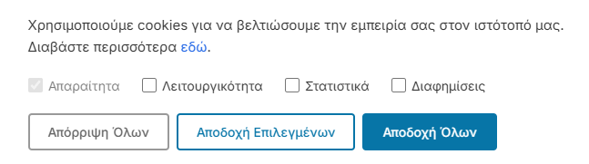

=== Κέντρο Συγκατάθεσης Cookies ===
Contributors: Computer Studio
Tags: cookies, consent, gdpr, cookie banner, tag manager
Requires at least: 6.0
Tested up to: 6.9
Requires PHP: 8.0
Stable tag: 1.2
License: GPL-2.0-or-later
License URI: https://www.gnu.org/licenses/gpl-2.0.html

Ολοκληρωμένο σύστημα διαχείρισης συγκατάθεσης cookies για τον ιστότοπό σας.

== Περιγραφή ==

Το **Κέντρο Συγκατάθεσης Cookies** παρέχει ένα ολοκληρωμένο οικοσύστημα για τη διαχείριση της συγκατάθεσης cookies στον ιστότοπο. Περιλαμβάνει:

* Ενσωμάτωση Google Tag Manager.
* Cookie consent banner με υποστήριξη πολλαπλών κατηγοριών cookies. Υποστηρίζονται οι κατηγορίες: security_storage, functionality_storage, personalization_storage, analytics_storage, ad_storage, ad_user_data, ad_personalization.
* Admin panel για διαχείριση κατηγοριών cookies, χρωμάτων και κειμένων banner.
* Συμβατότητα με WPML για εμφάνιση κείμενων σε Ελληνικά και Αγγλικά. 

Δείγμα banner:

== Εγκατάσταση ==

1. Ανεβάστε τον φάκελο `cookie-center` στον κατάλογο `/wp-content/plugins/`.
2. Ενεργοποιήστε το πρόσθετο μέσα από το μενού «Πρόσθετα» του WordPress.
3. Μεταβείτε στο μενού Εργαλεία → Διαχείριση Cookies για να ρυθμίσετε τις κατηγορίες cookies.

